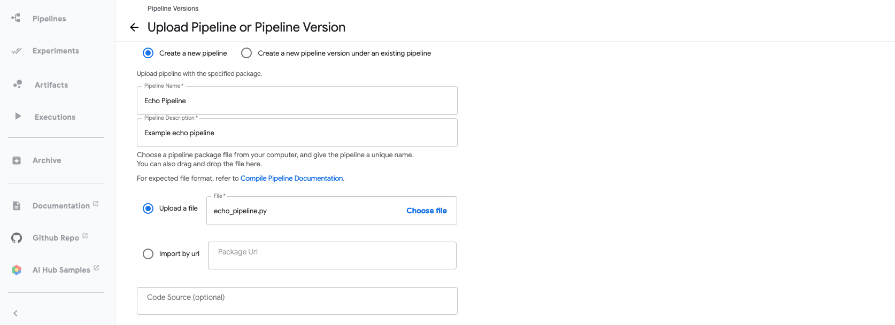
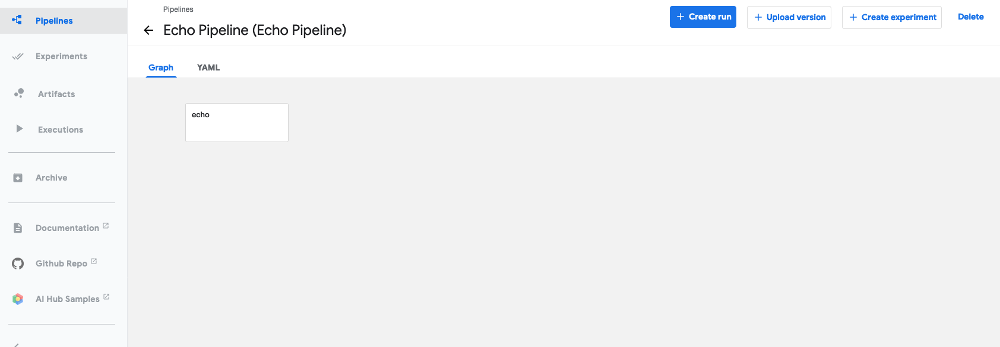
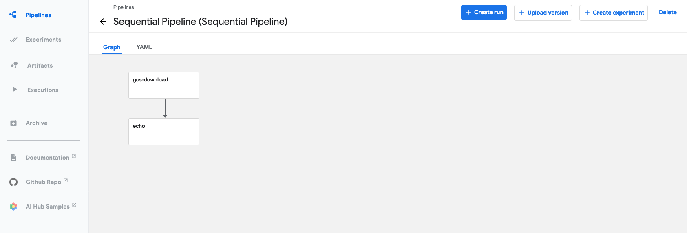
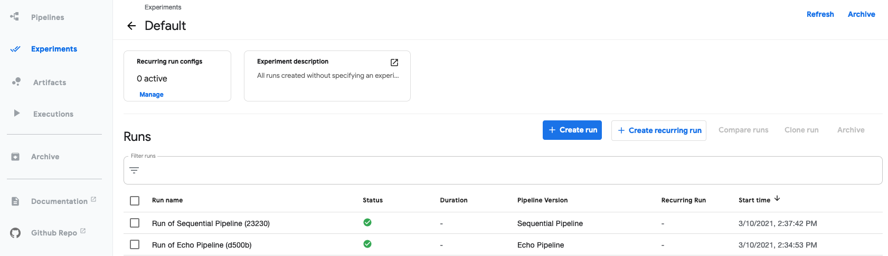

# Installing Kubeflow Pipelines on OpenShift

Simplified instructions to install Kubeflow Pipelines (KFP) on OpenShift, running on OpenShift Pipelines (Tekton).

## Prerequisites

* OpenShift 4 Cluster
* Admin access to cluster
* [OpenShift CLI](https://docs.openshift.com/container-platform/4.6/cli_reference/openshift_cli/getting-started-cli.html)

## Prep

Login to the cluster using `oc login` and admin credentials.

Install Open Data Hub

* Login to the cluster using the console and admin credentials.
* Navigate to OperatorHub and search for `Open Data Hub Operator`
* Install using the `beta` channel.  The version installed in this guide is `1.0`.
* Under the install operators, you should see the status of the operator change to `Succeeded`

Install OpenShift Pipelines (Tekton)

* Login to the cluster using the console and admin credentials
* Navigate to OperatorHub and search for `OpenShift Pipelines`
* Pick the channel corresponding to your version of OpenShift
* Install and verify the status of the operator changes to `Succeeded`

## KFP on Tekton

### Install

Follow these [instructions](https://github.com/kubeflow/kfp-tekton/blob/master/guides/kfp-tekton-openshift.md#prepare-openshift-cluster-environment) to prepare your environment and download the `tkn` and `kfctl` binaries.


Deploy KFP

```bash
export KFDEF_DIR=<set-your-path>
mkdir -p ${KFDEF_DIR}
cd ${KFDEF_DIR}
export CONFIG_URI=https://raw.githubusercontent.com/IBM/KubeflowDojo/master/OpenShift/manifests/kfctl_tekton_openshift_minimal.v1.1.0.yaml
kfctl apply -V -f ${CONFIG_URI}
```

Open KFP console in your browser

```bash
oc expose svc ml-pipeline-ui -n kubeflow
echo $(oc get route ml-pipeline-ui -n kubeflow --template='http://{{.spec.host}}')
```

### Smoke Test

Install the [KFP-Tekton-SDK](https://www.kubeflow.org/docs/components/pipelines/sdk/pipelines-with-tekton/#installing-the-kfp-tekton-sdk)

> Remember to add `dsl-compile-tekton` to your path.  If you have both Python2 and Python3, you might have to add the binary to your path, e.g. `export PATH=$PATH:/Users/.../Library/Python/3.8/bin`

Make a local copy of the [echo pipeline example](https://www.kubeflow.org/docs/ibm/pipelines/) as `echo_pipeline.py`.

Make a local copy of the [sequential example](https://github.com/kubeflow/pipelines/blob/master/samples/core/sequential/sequential.py) as `sequential.py`.

Compile both examples

```bash
dsl-compile-tekton --py echo_pipeline.py --output echo_pipeline.yaml
dsl-compile-tekton --py sequential.py --output sequential.tar.gz
```

Open KFP console in your browser

```bash
echo $(oc get route ml-pipeline-ui -n kubeflow --template='http://{{.spec.host}}')
```

Upload pipelines `echo_pipeline.yaml` and `sequential.tar.gz`.  For example, 



For each pipeline, start a `Pipeline Run` in the `Default` Experiment.





If you navigate to your `Default` Experiment, you should see both pipeline runs complete.



